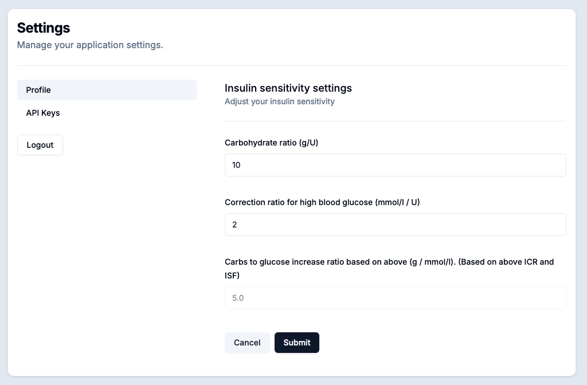
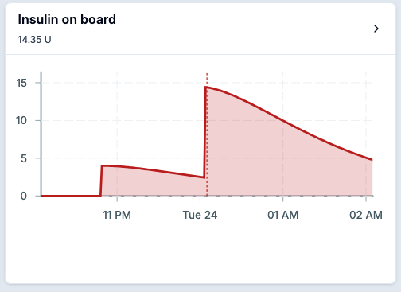

# Gluwave

## Features

- [x] Smart glucose [prediction algorithm](#algorithm)
- [x] Integrate glucose from Freestyle Libre 2 / 3, or manually input fingerprick results
- [x] Calculate insulin on board
- [x] Log meals

## Installation

You can use publicly available instance at https://iob.kalhama.fi/ or you can [self host](#self-hosting)

## Using Gluwave

Using Gluwave is simple with followin steps

### Configure settings

Update your carbohydrate ratio and correction ratio in the settings

### Adding entries (glucose, carbohydrate and insulin)

You can add new glucose, carbohydrate and insulin entries from the bottom toolbar.

**Example of adding new meal entry:**

1. When was the meal
2. How big was the meal in carbs
3. How long do you expect your body to absorb the meal

### Main screen

Main screen is split into three sections:

#### Glucose

First of them is historical glucose and predictions. Green predictioon is what predictions would be without any insulin and red is without any meal. These serve just as a "confidence interval". The gray line is the real prediction.

You can see the list of your blood glucose entries if you click the `Eventually Y mmol/l` on top right

[Read more](#algorithm) about prediction algorithm

#### Insulin

Second section is for insulin on board. Again you can view and edit the insulin entries by clicking the `IOB X U` on top right.

> [!WARNING]  
> All insulin is assumed to be Fiasp. [Open an issue](https://github.com/Kalhama/gluwave/issues) for new insulin types

#### Carbs

Final section is about your daily carbs and how they have been absorbed over time.

If you view the list of carbs you can see how much carbs we actually observed

## Algorithm

Algorithm is based on three things

1. Last known blood glucose:
2. Remaining carbs, that is reported carbs minus observed carbs until now
   - Remaining carb abosrption speed is same as originally reported absorption speed ($rate = carbs / absorption time$)
3. Remaining insulin

Then insulin is assumed to continue its decay, carbs are predicted to decay at their original rates. Combine them and you get the final prediction.

## Integrating with Freestyle Libre 2 / 3

If you want to integrate Freestyle Libre into the app you need to run the piece of integration yourself. The documentation of it is in separate repo: [Github - librelinkup-to-iob-calculator](https://github.com/Kalhama/gluwave/tree/master/librelinkup-to-iob-calculator)

## Credits

Big credits to folks at Loop. I have shamelessly copied many of their achievements and concepts.

## Self hosting

Check the example [docker-compose.yml](https://github.com/Kalhama/gluwave/blob/master/nextjs/docker-compose.yml)

## Technology stack

- Framework: [Next.js](https://nextjs.org/docs)
- ORM and database: Drizzle + postgres
- Forms: [react-hook-form](https://react-hook-form.com/)
- (Form) validation: [zod](https://github.com/colinhacks/zod)
- Styles: [tailwindcss](https://tailwindcss.com/), sass, normalize.css
- UI libraries: [shadcn/ui](https://ui.shadcn.com/)
- Icons: [lucide-react](https://lucide.dev/icons/)
- Linter: ESLint
- Formatter: Prettier
- Misc:
  - Axios
  - [react-datepicker](https://reactdatepicker.com/)
  - [@tanstack/react-table](https://tanstack.com/table/latest)
  - and other at [package.json](./nextjs/package.json)
- Authorization: [lucia-auth](https://lucia-auth.com/)

## Bug reports, feature reqeusts, support

Please fill a new [Github issuse](https://github.com/Kalhama/gluwave/issues)

## Contact

If you want to reach me personally you can reach me via mail [max@kalhama.fi](mailto:max@kalhama.fi)
